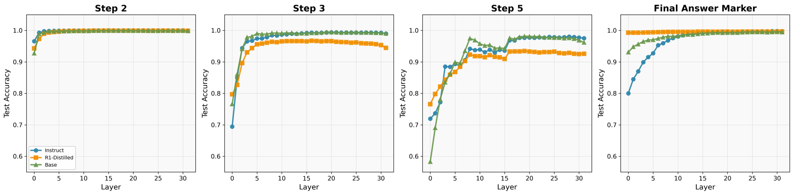
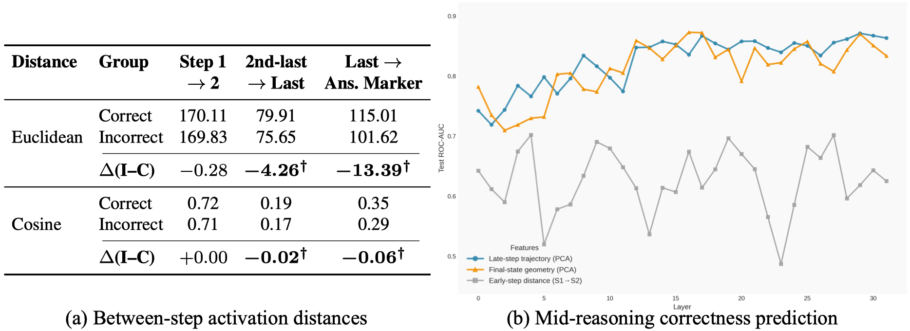
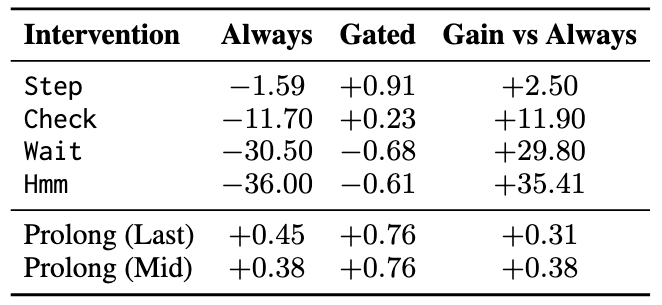
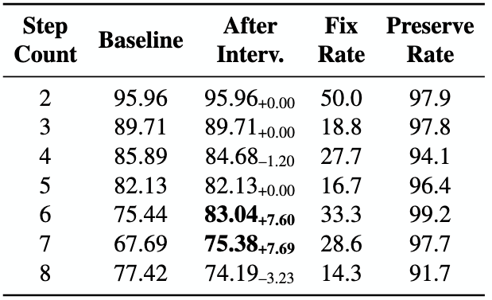
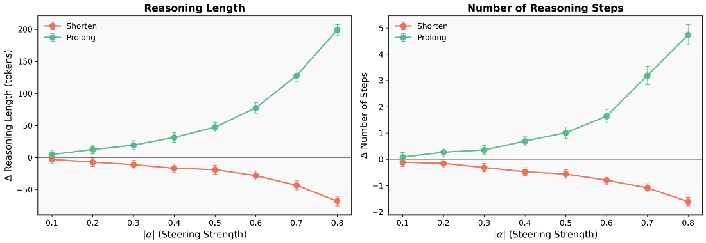

# LLM Reasoning as Trajectories: Step-Specific Representation Geometry and Correctness Signals

[Lihao Sun](https://slhleosun.github.io/) &#185;, [Hang Dong](https://www.microsoft.com/en-us/research/people/hangdong/) &#185;, [Bo Qiao](https://www.microsoft.com/en-us/research/people/boqiao/) &#185;, [Qingwei Lin](https://www.microsoft.com/en-us/research/people/qlin/) &#185;, [Dongmei Zhang](https://www.microsoft.com/en-us/research/people/dongmeiz/) &#185;, [Saravan Rajmohan](https://www.microsoft.com/en-us/research/people/saravar/) &#185;

&#185; Microsoft

[[Paper]](https://arxiv.org/abs/2604.05655)

[[Project Webpage]](https://slhleosun.github.io/reasoning_traj)

Accepted to ACL 2026 Main Conference

### TL;DR 
CoT reasoning in LLMs traces structured trajectories through representation space — step-specific regions become linearly separable with depth, late-step geometry predicts correctness, and trajectory-based steering enables both error correction and reasoning length control at inference time.

## Overview
Current large language models generate chain-of-thought (CoT) reasoning that can be viewed as a trajectory through representation space. We characterize this trajectory and find that it is highly structured: each reasoning step occupies a distinct, linearly separable region that becomes progressively more delineated at deeper layers. This organization is already present in base models — reasoning training primarily reshapes *when* convergence occurs rather than introducing new representational structure.

Building on this, we show that correct and incorrect solutions follow similar early-step paths but diverge systematically at late steps, yielding actionable mid-reasoning correctness signals. We further introduce *trajectory-based steering*, an inference-time intervention framework that enables both error correction and reasoning length control without retraining.


## Using this directory

The codebase is organized into four main components matching the paper structure: **inference & activation extraction** (`src/`, `scripts/behavioral/`), **probes & predictors** (`scripts/predictors/`), **steering & interventions** (`scripts/steering/`), and **trajectory analysis** (`scripts/trajectories/`). All main experiments use three variants of Llama 3.1 8B with deterministic greedy decoding. Every script in this repository directly produces a figure or table in the paper.

## A quick walkthrough of our findings

### Step-Specific Representation Subspaces (Section 3)

> :file_folder: Relevant files: `scripts/behavioral/`, `scripts/predictors/apply_linear_probes.py`, `scripts/predictors/train_stepwise_probes.py`



We extract hidden-state activations at each `Step` marker during chain-of-thought reasoning and find a striking geometric structure:

- **Step-specific regions exist and are linearly separable.** Each reasoning step occupies a distinct region in representation space. Step 1 has probe accuracy above 0.99 at every layer; later steps become separable at deeper layers (Fig 1, Table 1).
- **Structure is shared across training regimes.** Cross-model transfer of step-specific linear probes achieves accuracy above 0.90 for nearly all model pairs (Table 1, Table 6).
- **Robust to prompt format.** Probes trained on fixed-format `Step X:` activations transfer strongly to freeform responses with no `Step` markers, with best-layer accuracies consistently above 0.84 (Table 7). As a control, probes trained on shuffled step labels achieve only 0.59 ± 0.04 average accuracy.

### Correctness in Trajectory Geometry (Section 4)

> :file_folder: Relevant files: `scripts/predictors/train_predictors.py`, `scripts/trajectories/`, `scripts/predictors/logprob_entropy_baseline.py`



We analyze the paths connecting successive reasoning steps and find a clear correctness signal:

- **Early-step geometry is correctness-invariant.** Activation distances between Steps 1 and 2 show no statistically significant difference between correct and incorrect solutions (Fig 2a).
- **Late-step trajectories diverge.** The final transition (last step to answer marker) shows Euclidean distance differences of −13.39 between correct and incorrect trajectories (Fig 2a).
- **Trajectory features predict correctness with ROC-AUC 0.87** (peak at layer 29), substantially outperforming step-count-only baselines (0.65) and logit-lens features (0.77) (Table 3, Fig 2b).

### Error-Targeted Inference-Time Interventions (Section 4.3)

> :file_folder: Relevant files: `scripts/steering/error_aware/`, `scripts/steering/intervene_all_steering.py`


<!-- Place Paper Table 4 here (rendered as figure: unconditional vs. error-targeted interventions on GSM8K) -->

We show that unconditional test-time scaling (always injecting control tokens) is often harmful — reducing accuracy by up to 36%. Instead, we use correctness predictors to gate interventions:

- **Predictor-gated interventions improve over unconditional ones** by up to +35.4% (relative to always-on), intervening on only 12.3% of examples (Table 4).
- **Activation steering** (Prolong direction) applied at predicted-incorrect examples yields consistent gains (Table 4).

### Trajectory-Based Steering (Section 5)

> :file_folder: Relevant files: `scripts/steering/traj_based/`



We introduce trajectory-based interventions that adaptively steer activations during generation based on deviation from an *ideal reasoning trajectory* derived from correct examples:

- **Correctness correction** is most effective on longer reasoning chains: accuracy improves from 75.44% to 83.04% (+7.60%) on 6-step problems and from 67.69% to 75.38% (+7.69%) on 7-step problems, with preservation rates above 97% (Fig 3a).
- **Reasoning length control** via the termination subspace enables smooth, continuous adjustment of reasoning length with minimal accuracy impact (Fig 3b).



### Cross-Task Generalization (Section 4.4)

> :file_folder: Relevant files: `scripts/mmlu/generate_mmlu.py`, `scripts/predictors/`

Step-specific probes trained on GSM8K transfer robustly to both MATH-500 and MMLU, with best-layer accuracies above 0.85 for all steps. Steering vectors derived from GSM8K also improve MATH-500 accuracy from 36.40% to 38.20% without retuning (Table 5).

## Setup

### Requirements

- Python 3.10+
- PyTorch
- Transformers (HuggingFace)
- scikit-learn, numpy, scipy

```bash
pip install torch transformers scikit-learn numpy scipy tqdm matplotlib seaborn
```

### Configuration

Edit `config/paths.yaml` to point to your local models and datasets. By default, models are referenced by their HuggingFace IDs:

| Model | HuggingFace ID | Description |
|-------|---------------|-------------|
| Base | `meta-llama/Llama-3.1-8B` | Pretrained, no instruction tuning |
| Instruct | `meta-llama/Llama-3.1-8B-Instruct` | Instruction tuning + preference alignment |
| R1-Distill | `deepseek-ai/DeepSeek-R1-Distill-Llama-8B` | CoT distillation |

Datasets: [GSM8K](https://huggingface.co/datasets/openai/gsm8k) (7,473 train / 1,319 test) and [MATH-500](https://huggingface.co/datasets/HuggingFaceTB/MATH-500) (500 questions).

